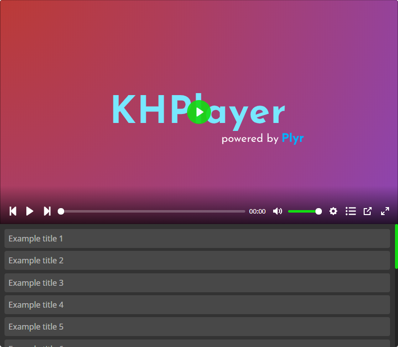
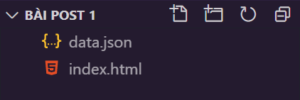
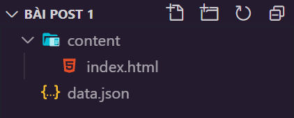
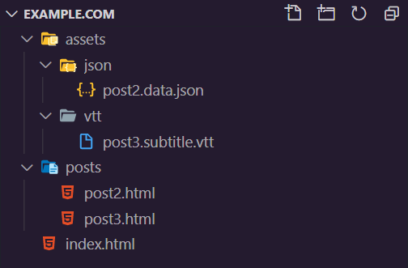

## **Tính năng chính**
Generate được một playlist player [như thế này](https://khplayer.delnegend.xyz/others/demo/) mà không động đến CSS, JS



## **Các tính năng khác**
- **Playlist.** *(KHPlayer)*
- Mỗi video chọn được nhiều phụ đề/độ phân giải. *(Plyr)*
- Gán poster cho từng tập cũng như poster mặc định. *(Plyr)*
- Tự động next tập, dừng lại khi đến tập cuối cùng. *(KHPlayer)*
- Generate nhiều playlist trên cùng 1 trang mà không bị xung đột lẫn nhau *(KHPlayer)*
- Hỗ trợ playback .m3u8 *(HLS)* + phụ đề *(KHPlayer)*
- Lưu lại tập/thời lượng đang xem tới *(KHPlayer)*
- Và nhiều tính năng khác (có thể) có thêm trong tương lai...

<hr>

## **Hướng dẫn sử dụng**
### A. Thêm vào ```<head></head>``` nếu chưa có.

Framework Plyr
```html
<script src="https://cdn.jsdelivr.net/gh/sampotts/plyr@3.6.2/dist/plyr.min.js"></script> 
```
 Thêm hls.js nữa nếu có ý định dùng file m3u8
 ```html
 <script src="https://cdn.jsdelivr.net/npm/hls.js@0.13.2/dist/hls.min.js"></script>
 ```
 Cuối cùng thêm 2 file css này
 ```html
 <link rel="stylesheet" href="https://cdn.jsdelivr.net/gh/sampotts/plyr@3.6.2/dist/plyr.css">
 <link rel="stylesheet" href="https://cdn.jsdelivr.net/gh/DELNEGEND/khplayer@5.3/dist/khplayer.min.css">
 ```

<hr width='50%'>

### B. Chuẩn bị nguyên liệu
- <details>
    <summary>Video | Ảnh bìa nếu muốn</summary>

  - File video sử dụng 1 trong những codec/format [này](https://www.encoding.com/html5-video-codec/).<br>
    Ngắn gọn: video AVC (H264) + audio AAC + format .mp4 tương thích nhất.

  - Recommend dùng [Handbrake](https://handbrake.fr/) để convert. Sử dụng sẵn presets trong General > sang tab Summary tích Web Optimized > sang tab Audio bitrate = 256 hoặc 320 > Start Encode.

  - Hoặc nếu đã chuẩn codec AVC + AAC thì dùng ffmpeg để chuyển đổi format với câu lệnh
  ```
  ffmpeg -i input.mkv -codec copy output.mp4
  ```

  - Thumbnail có thể lên Google kiếm, còn nếu muốn lấy từ file video
  ```
  ffmpeg -ss 01:23:45 -i input.mp4 -vframes 1 -q:v 2 output.jpg
  ```

  - Upload video và ảnh bìa lên cloud storage có direct link ([đọc phần này](#tips)).<br><br>
    

  </details>

- <details>
    <summary>Preview thumbnail (nếu muốn)</summary>

  Dịch sơ qua là ảnh xem trước như thế này

  

  Bao gồm nhiều file ảnh preview hoặc ghép hết thành 1 (sprite thumbnail) và 1 file .vtt cho biết ảnh preview nào ở đoạn nào. Ở đây mình hướng dẫn tạo cho trường hợp sprite thumbnail:

  - Cài [NodeJS](https://nodejs.org/), [ffmpeg](https://ffmpeg.org/download.html).
  - [Điền form này](https://khplayer.delnegend.xyz/others/genSpriteThumbCode/), chưa cần điền `Link ảnh trực tiếp`.
  - Mở powershell/terminal > `cd "D:\thư\mục\chứa\file\video.mp4"` > dán câu lệnh `Tạo file jpg` > Enter.
  - Upload file .jpg lên cloud, lấy link trực tiếp rồi dán vào `Link ảnh trực tiếp` trong form trên. ([đọc phần này](#tips))
  - [Clone/download repo này](https://github.com/radiantmediaplayer/rmp-create-vtt-thumbnails) hoặc [ấn đây để tải xuống](https://github.com/DELNEGEND/khplayer/blob/master/others/README_Data/rmp-create-vtt-thumbnails.zip?raw=true) và giải nén.
  - Quay lại powershell/terminal > `cd "D:\thư\mục\vừa\trên\"` > dán câu lệnh `Tạo file vtt` trong form và Enter.
  - Upload file .vtt lên cloud có direct link ([đọc phần này](#tips)) không bị chặn [CORS](https://topdev.vn/blog/cors-la-gi/), nếu có thì sử dụng một số CORS proxy như [thingproxy](https://github.com/Freeboard/thingproxy), [yacdn.org](https://github.com/ovsoinc/yacdn.org),...<br>
  Ngắn gọn: CORS là cơ chế chặn/cho phép website khác sử dụng tài nguyên từ website mình. Như này là bị chặn:<br><br>
    <br><br>
    Đối với link OneDrive/Google Drive hãy rút gọn qua [bit.ly](https://bit.ly/) (hoặc bất cứ url shortenter nào) để "ẩn" phần `?export=download`, `?download=1`,... tránh xung đột với param của các proxy.

  </details>

- <details>
    <summary>File phụ đề .vtt (nếu muốn)</summary>
  
  - Convert .ass hay .srt sang .vtt: [Google](https://google.com)
  - Kiểm tra .vtt "chuẩn" [quuz.org/webvtt/](https://quuz.org/webvtt/) | [dự phòng](https://khplayer.delnegend.xyz/others/VTT_Validation/)
  - Upload lên cloud có direct link ([đọc phần này](#tips)).<br>
    Tương tự như file .vtt preview thumbnail, cần lưu ý tới [CORS](https://topdev.vn/blog/cors-la-gi/).
  
  </details>
<hr width='50%'>

### C. Build lên thành player
  - Điền form [này](https://khplayer.delnegend.xyz/others/genScreen).<br> (DL viết tắt cho direc link - link trực tiếp)
  Sau khi ấn "Hoàn thành" sẽ hiện ra 2 button:
  - Nếu trên webpage chưa có `<script src="khplayer.js"></script>`, nhấn "Tạo mới":
    
    <details>
      <summary>Xem thêm</summary>

      - Nhấn "Tải file JSON", upload lên cloud có direct link ([đọc phần này](#tips))
      - Nhấn "Sao chép container", dán vào vị trí muốn đặt playlist player trên webpage (dùng id khác nhớ edit phần tử cuối trong file JSON vừa tải).
      - Tiếp đến thêm `<script>` này vào webpage, chỗ nào cũng được:
        ```html
        <script defer src="https://cdn.jsdelivr.net/gh/DELNEGEND/khplayer@5.3/dist/khplayer.min.js" jsonPath='<array (các) đường dẫn đến file JSON>'></script>
        ```
      - Phần "array các đường dẫn đến fle JSON" dán link trực tiếp file .json

          ```javascript
          jsonPath='["//example.com/KHP_123456.json"]'
          // Ngoài cùng là ngoặc đơn, bọc quanh các phần tử là ngoặc kép
        ```
      
    </details>

  - Nếu webpage đã có `<script src="khplayer.js"><script>`:
    <details>
      <summary>Xem thêm</summary>

      - Cũng nhấn "Tạo mới" Làm bước 1 và 2 như trên.
      - Thêm đường dẫn tới file JSON mới này vào array jsonPath nằm trong thẻ ```<script>``` trên ví dụ:

          ```javascript
          jsonPath='["//example.com/KHP_123456.json","//example.com/KHP_654321.json"]'
          ```

    </details>

  - Nếu thêm video vào playlist player đã tạo trước đó, nhấn "Thêm vào playlist đã có", copy đoạn data được generate và thêm vào array trong file JSON trước 2 element cuối.

<hr width='50%'>

### D. Lưu ý
 - Đối với định dạng m3u8, KHPlayer chưa hỗ trợ nhiều độ phân giải cùng lúc. Trên trang Generator vẫn để được phép chọn nhiều source để sau này (có thể) sẽ bổ sung tính năng.

<hr>

<div id="tips">

# Link trực tiếp:
- [Lấy link download trực tiếp trên dropbox, OneDrive - Blog chia sẻ kiến thức](https://blogchiasekienthuc.com/thu-thuat-internet/lay-link-download-truc-tiep-direct-link-tren-dropbox-onedrive.html#:~:text=Direct%20link%20l%C3%A0%20d%E1%BA%A1ng%20link,th%C3%AAm%20m%E1%BB%99t%20l%E1%BA%A7n%20n%C3%A0o%20n%E1%BB%AFa.)
- [Cách tạo direct link Google Drive - GDrive.vip](https://gdrive.vip/cach-tao-direct-link-google-drive-tai-truc-tiep-google-drive-direct-download-link-generator/)
- File trên Google Drive [nhỏ hơn 100MB](https://support.google.com/a/answer/172541?hl=en) dùng link dạng: `https://drive.google.com/uc?export=download&id=xxxxxxxxxxxxxxxx`.
- File trên OneDrive 5TB thay `?e=xxxxx` bằng `?download=1`
- Dùng [Fast.io](https://fast.io/) đối với:
  - Google Drive cá nhân/unlimited
  - OneDrive cá nhân/5TB
  - Dropbox
  - Box
  - MediaFire
  - GitHub<br><br>
- <details><summary>Nếu đang sử dụng static site generator như Hugo, Jekyll,...:</summary>
  
  - Dữ liệu nằm cùng thư mục với index.html<br><br>
    <br>
    ```
    data.json
    ```
  - Dữ liệu nằm trong thư mục con<br><br>
    <br>
    ```
    assets/json/data.json
    assets/vtt/data.vtt
    ```
  - Dữ liệu nằm trong thư mục "phụ huynh"<br><br>
    <br>
    ```
    ../data.json
    ```
  - Không rõ vì sao bạn lại muốn để file theo kiểu này nhưng<br>
    Dấu gạch "/" ở đầu nghĩa là lấy file từ domain gốc

      ```
      /data.ext = "//example.com/data.ext"
      ```
    

    - Trong index.html
      ```
      /assets/json/post2.data.json
      /assets/vtt/post3.subtitle.vtt
      
      <=>
      
      assets/json/post2.data.json
      assets/vtt/post3.subtitle.vtt
      ```
    - Trong post2.html, post3.html
      ```
      /assets/json/post2.data.json
      /assets/vtt/post3.subtitle.vtt
      
      <=>
      
      ../assets/json/post2.data.json
      ../assets/vtt/post3.subtitle.vtt
      ```

</details>
</div>
<hr>

# Credit
- [Plyr](https://plyr.io) - APIs, player, themes,...
- [hls.js](https://github.com/video-dev/hls.js/) - M3U8 library.
- [FontAwesome](https://fontawesome.com/) - next/prev, toggle menu button.
- [radiantmediaplayer](https://github.com/radiantmediaplayer) - tutorial to how to create sprite thumbnail.